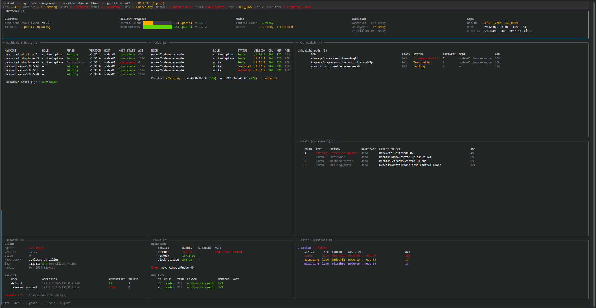

<p align="center">
  
</p>

<p align="center">
  <a href="https://github.com/runlevel-six/binnacle/actions/workflows/ci.yaml"></a>
  <a href="LICENSE"></a>
</p>

A suite for monitoring **Cluster API on bare metal**: two front ends onto one
data layer, one for the bridge and one for the operator's hands.

- **Binnacle** is the fixed, always-on fleet view. A web page that shows every
  cluster a management cluster owns — readiness, versions, replica counts,
  whether an upgrade is in flight — updated live over Server-Sent Events.
- **sextant** is the handheld terminal client. A single-cluster dashboard for
  when an operator is in a maintenance window for one cluster and needs to watch
  a rolling upgrade move across `Machine` → `Metal3Machine` → `BareMetalHost`,
  with the workload cluster's reaction on the same screen.

A **binnacle** is the lit stand on the bridge that houses the compass: mounted,
always on, read by the whole watch. A **sextant** is handheld: you pick it up,
take a sighting, put it down. The names are the architecture.

## Install

### sextant (terminal client)

Releases attach statically linked binaries for Linux and macOS on x86_64 and
arm64. No runtime dependencies, and no Go toolchain needed unless you want one.

**A tagged release** — the one to pin. Grab the tarball for your platform from the
[releases page](https://github.com/runlevel-six/binnacle/releases), which prints the
exact `curl` line for each, then:

```sh
tar -xzf sextant_*_linux_amd64.tar.gz sextant
install -m 0755 sextant ~/.local/bin/sextant
```

**Current `main`** — the `edge` prerelease is rebuilt on every merge, so this URL
always resolves to the tip of the branch. Substitute `linux_arm64`, `darwin_amd64`
or `darwin_arm64` as needed:

```sh
curl -sSfL https://github.com/runlevel-six/binnacle/releases/download/edge/sextant_edge_linux_amd64.tar.gz \
  | tar -xz sextant
install -m 0755 sextant ~/.local/bin/sextant
```

**With Go:**

```sh
go install github.com/runlevel-six/binnacle/cmd/sextant@latest
```

### binnacle (server + web)

Deployed as a container image — manifests are in [`deploy/`](deploy/), with a
`Dockerfile` at the root. Releases also attach it as a binary for every
platform sextant gets, because `binnacle --demo` needs no cluster and no
credentials, and installing a Go toolchain or deploying into Kubernetes is a
lot to ask of somebody deciding whether they want the thing at all.

```sh
# A tagged release
tar -xzf binnacle_*_linux_amd64.tar.gz binnacle
install -m 0755 binnacle ~/.local/bin/binnacle

# Current tip
curl -sSfL https://github.com/runlevel-six/binnacle/releases/download/edge/binnacle_edge_linux_amd64.tar.gz \
  | tar -xz binnacle
install -m 0755 binnacle ~/.local/bin/binnacle

# With Go
go install github.com/runlevel-six/binnacle/cmd/binnacle@latest
```

```sh
binnacle --demo     # the fleet page, an invented fleet, no cluster needed
binnacle --version  # which build this is
```

## Try sextant

```sh
./sextant --demo              # the whole dashboard, no cluster needed
./sextant --list-contexts     # what the resolver sees, and what it picked
./sextant --debug-snapshot -v # can it read your cluster? one line per source
./sextant                     # the dashboard, on your current context
```

`--demo` runs against invented data — a control-plane rollout mid-flight, a host
that failed to provision, a node that has not come back — so you can see what the
tool does before pointing it at anything.

```sh
./sextant --demo --render 280x84   # one frame to stdout, no TTY required
```

Keys: `?` help, `tab` cycle focus, `1`–`9` jump, `z` zoom, `[`/`]` columns,
`p` freeze, `T` theme, `q` quit.

## Try binnacle

Against your own kubeconfig, for development:

```
binnacle --management-context mgmt-01 --profile my-site
```

That listens on `127.0.0.1:8080` with no authentication, which is fine on a
machine only you are on. Binnacle **refuses to start** unauthenticated on any
other address: it reads every cluster in the fleet with credentials of its own,
so an open listener is an open window into all of them.

Three pages, each pushed over Server-Sent Events rather than polled:

| Page | What it holds |
|---|---|
| `/` | Every cluster as a card, worst first, plus the datacenter's storage layer and the management cluster's own summary. |
| `/cluster/{namespace}/{name}` | One cluster in full: nodes, subsystems, network, cloud, unhealthy pods, node pools, machines, hardware, events. |
| `/management` | The management cluster itself — its unhealthy pods, the controllers every workload cluster depends on, its nodes, and the Cluster API events that belong to no workload cluster. It has no `Cluster` object of its own, so it gets a page of its own. |

### Deployment shape

**One binnacle per management cluster, running on it.** Each instance discovers
the clusters its own management cluster owns, takes in-cluster credentials from a
ServiceAccount there, and is reached through an Ingress on that cluster. Nothing
has to route between sites.

```
binnacle \
  --addr :8080 \
  --site site-a \
  --namespace managed-clusters \
  --oidc-issuer https://sso.example/realms/platform \
  --oidc-client-id binnacle \
  --oidc-redirect-url https://binnacle.site-a.example/auth/callback
```

Set `--site`. Sites reuse workload cluster names, so two instances otherwise
render pages identical down to the names on the cards, and a tab strip shows
only the title. It is the one thing telling two open tabs apart.

The client secret comes from `$BINNACLE_OIDC_CLIENT_SECRET` and the session
signing key from `$BINNACLE_SESSION_KEY` — any secret of at least 32 characters,
or base64 of at least 32 bytes. Neither is a flag, because a command line is
visible in the process table. Set the session key explicitly for more than one
replica: sessions signed by one pod are rejected by the others, and the symptom
is a sign-in that loops rather than an error anyone can read.

### Access

Everyone who can sign in sees everything binnacle's ServiceAccount can see.
That is a deliberate simplification and it is the right trade for a status
board, but it is a real one: binnacle's RBAC, not the reader's, decides what is
on the page.

## Themes (sextant)

```sh
./sextant --list-themes
./sextant --theme lcars
```



| Theme | Look | |
|---|---|---|
| `default` | green/amber/red on rounded borders | [screenshot](docs/theme-default.png) |
| `ansi` | the terminal's own sixteen colors, so it inherits your scheme | [screenshot](docs/theme-ansi.png) |
| `lcars` | LCARS-style console: black ground, block rails, amber and violet | [screenshot](docs/theme-lcars.png) |
| `ncurses` | DOS-era curses: blue panels, double-line boxes, white ink | [screenshot](docs/theme-ncurses.png) |

Set one with `--theme`, `SEXTANT_THEME`, or `theme:` in the config file, or press
`T` to cycle through them live. A theme colors the chrome and the status
palette; it never rewrites data, so a context or cluster name reads the same
under all of them.

`lcars` is what it sounds like. It is a real theme rather than a hidden flag —
`--list-themes` names it, and the health colors still mean what they mean — but
nobody will mistake it for the sober option.

It is an homage built from color values and box-drawing characters: no fonts,
artwork, or images from any source are included. This project is not affiliated
with, endorsed by, or sponsored by CBS Studios or Paramount, and Star Trek and
LCARS are the trademarks of their respective owners.

## Documentation

Full documentation for sextant is in [docs/](docs/index.md), organized by what
you are trying to do — [a first rollout](docs/tutorials/first-rollout.md) to
learn it, how-to guides for a specific goal, reference for looking things up,
and explanation for why it works the way it does.

Before you rely on it during a maintenance window, read
**[What sextant reports](docs/explanation/what-it-reports.md)** — what this tool
claims, what it refuses to claim, and how it says "I do not know".

## Design goals

- **Zero-config on a stock cluster.** Point it at a CAPI + Metal3 management
  cluster and it works. No site-specific setup required to see something useful.
- **Site-specific behavior lives in data, not code.** Node-role label keys,
  interesting namespaces, critical workloads and pane layout come from a YAML
  *profile*. Core Go contains no site-specific string literals.
- **Optional subsystems auto-detect.** Ceph, Cilium, MetalLB, OVN and OpenStack
  panes appear when those subsystems are present and disappear when they aren't
  — never an error you have to configure away.
- **Degrade, don't fail.** Missing `pods/exec` means a thinner pane, not a
  stack trace.
- **Read-only.** Neither tool ever issues a mutating API call.

## Configuration (binnacle)

| Flag | What it does |
|---|---|
| `--addr` | Listen address. Default `127.0.0.1:8080`. |
| `--kubeconfig`, `--management-context` | Management cluster credentials. Omit both to use in-cluster credentials. |
| `--namespace` | Scope cluster discovery. Empty means every namespace. |
| `--site` | Names this instance in the header and browser title. Set it whenever more than one binnacle exists. |
| `--profile` | The site profile describing how these clusters are laid out. |
| `--os-cloud` | The `clouds.yaml` entry to use for clusters whose own credentials do not name one. |
| `--clouds-dir` | Where per-cluster `clouds.yaml` files are written for gophercloud. Should be memory-backed. |
| `--oidc-issuer`, `--oidc-client-id`, `--oidc-redirect-url` | Turn on authentication. |
| `--insecure-cookies` | Send session cookies without `Secure`. Testing over plain HTTP only. |

## Required access

On the management cluster, read on `cluster.x-k8s.io` resources, the Metal3
kinds, and Events, plus `get` on `Secrets` in the namespaces the clusters live
in — that is where Cluster API keeps each workload cluster's kubeconfig. `list`
on those Secrets is needed only for the fallback that resolves a cluster whose
kubeconfig is not at the conventional name; without it, such a cluster reports
the reason on its card instead of disappearing. On each workload cluster,
whatever the plugins you want need — nodes, pods and workloads at minimum. A
plugin whose subsystem it cannot probe contributes nothing rather than failing,
so a narrow role degrades the page instead of breaking it.

## Development

```sh
git clone https://github.com/runlevel-six/binnacle.git
cd binnacle
make check    # fmt + vet + test
make build    # ./sextant and ./binnacle
make help     # all targets
```

Contributions welcome — see [CONTRIBUTING.md](CONTRIBUTING.md). The most useful
thing you can offer right now is a description of your cluster's shape, since
the default profile is only as good as the range of clusters we know about.

## License

[Apache 2.0](LICENSE)
